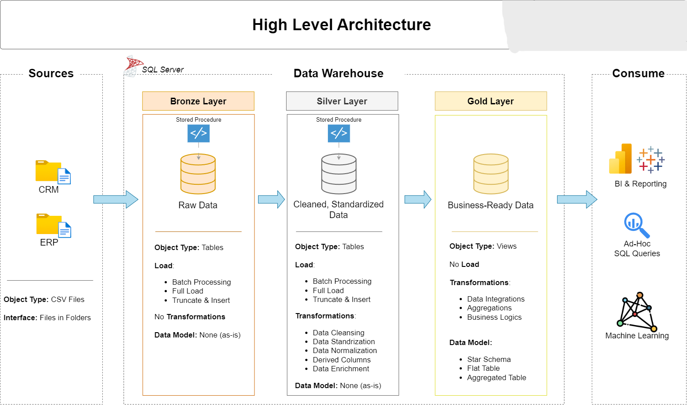
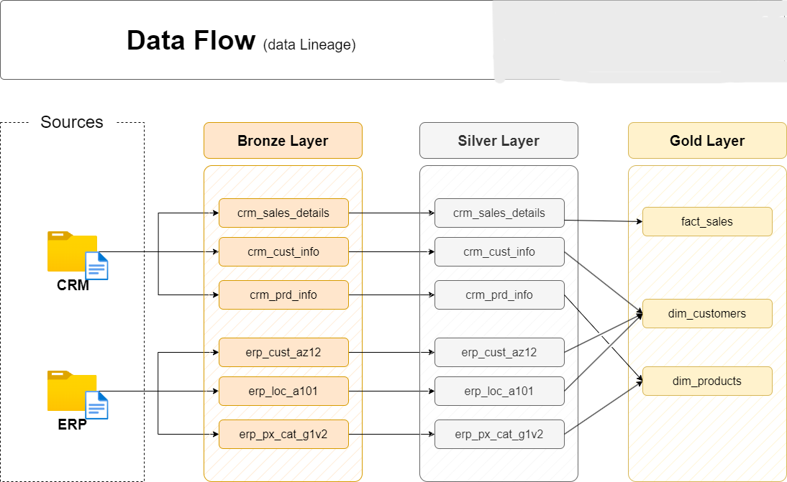
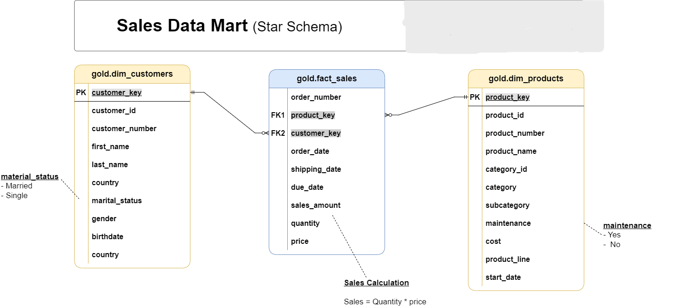

# DATA_BASE_Warehouse_project

# ❄️ End-to-End Data Warehouse Project in Snowflake

This project demonstrates a complete **modern Data Warehouse implementation** using Snowflake.  
It covers data ingestion from local files, multi-layer transformation, and analytical modeling using **Bronze, Silver, and Gold architecture**.

---

# 📌 Project Overview

The goal of this project is to design and build a scalable Data Warehouse that:

- Loads raw CSV data from local system
- Uses Snowflake internal stage for ingestion
- Transforms and cleans data
- Builds dimensional model (Star Schema)
- Produces analytics-ready tables

---

# 🧱 Architecture (Medallion Model)

The warehouse follows a layered architecture:

- **Bronze Layer** → Raw ingested data  
- **Silver Layer** → Cleaned & standardized data  
- **Gold Layer** → Dimensional model (Fact & Dimension)

---

# 🔄 Data Pipeline Flow

**Local Files → Snowflake Stage → Bronze → Silver → Gold**

1. Source CSV files stored in local system  
2. Uploaded to Snowflake internal stage  
3. Loaded into Bronze tables  
4. Cleaned & transformed into Silver  
5. Modeled into Gold (Dim & Fact)

---

# 📁 Repository Structure

```
DataWarehouseProject/
│
├── Script/
│   ├── bronze/
│   │       ├── dd_bronze.sql
│   │       └── bronze_load.sql
│   ├── silver/
│   │       ├── dd_silver.sql
│   │       └── silver_load.sql
│   │── gold/
│   │       └── dd_gold.sql
│   │
│   └── init_database.sql
│
├── documents/
│   ├── data_flow.png
│   ├── data_model.png
│   ├── data_integration.png
│   └── data_architecture.png
│
├── datasets
│   ├── source_crm/
│   │       ├── cust_info.csv
│   │       ├── cust_prd.csv
│   │       └── sales_details.csv
│   ├── source_erp/
│   │       ├── CUST_AZ12.csv
│   │       ├── CUST_AZ12.csv
│   │       └── PX_CAT_G1V2.csv
│   ├── AfterCleanData/
│          ├── dim_customers.csv
│          ├── dim_products.csv
│          └── fact_sales.csv
│   
└── README.md
```

---

# 🗺️ Data Architecture



---

# 🔄 Data Flow



---

# 🔗 Data Integration


---

# ⭐ Dimensional Model (Gold Layer)



The Gold layer follows a **Star Schema** design:

## Dimension Tables
- dim_customer
- dim_product
- dim_date
- dim_location

## Fact Tables
- fact_sales
- fact_orders

---

# ⚙️ Implementation Steps

## 1️⃣ Database & Schema Setup
- Created Snowflake database
- Created schemas: Bronze, Silver, Gold

## 2️⃣ Stage Creation
- Created internal Snowflake stage
- Uploaded CSV files from local system

## 3️⃣ Bronze Layer
- Loaded raw data from stage
- No transformations applied
- Maintains source structure

## 4️⃣ Silver Layer
- Data cleaning
- Null handling
- Standardization
- Deduplication
- Type conversions

## 5️⃣ Gold Layer
- Surrogate keys
- Dimension modeling
- Fact table creation
- Business-ready schema

---

# ❄️ Snowflake Features Used

- Internal Stage
- COPY INTO
- SQL Transformations
- Window Functions
- Date Handling
- Medallion Architecture
- Star Schema Modeling

---

# 📊 Business Use Cases

This warehouse supports:

- Sales analytics
- Customer analysis
- Product performance
- Trend reporting
- BI dashboards

---

# 🚀 How Data is Loaded

Example workflow:

1. Place CSV in local system
2. Upload to Snowflake stage
3. Run Bronze load procedure
4. Run Silver transformations
5. Build Gold model

---

# 📚 Key Learning Outcomes

- End-to-end ETL in Snowflake
- Data Warehouse architecture
- Dimensional modeling
- Data cleaning strategies
- Analytical schema design

---

# 👤 Author

**Thirumalesh**  
Aspiring Data Engineer  
Snowflake | SQL | Data Warehousing  

---

# ⭐ Project Status

✅ Data ingestion completed  
✅ Bronze layer built  
✅ Silver layer transformed  
✅ Gold dimensional model created  
✅ Documentation added  

---

